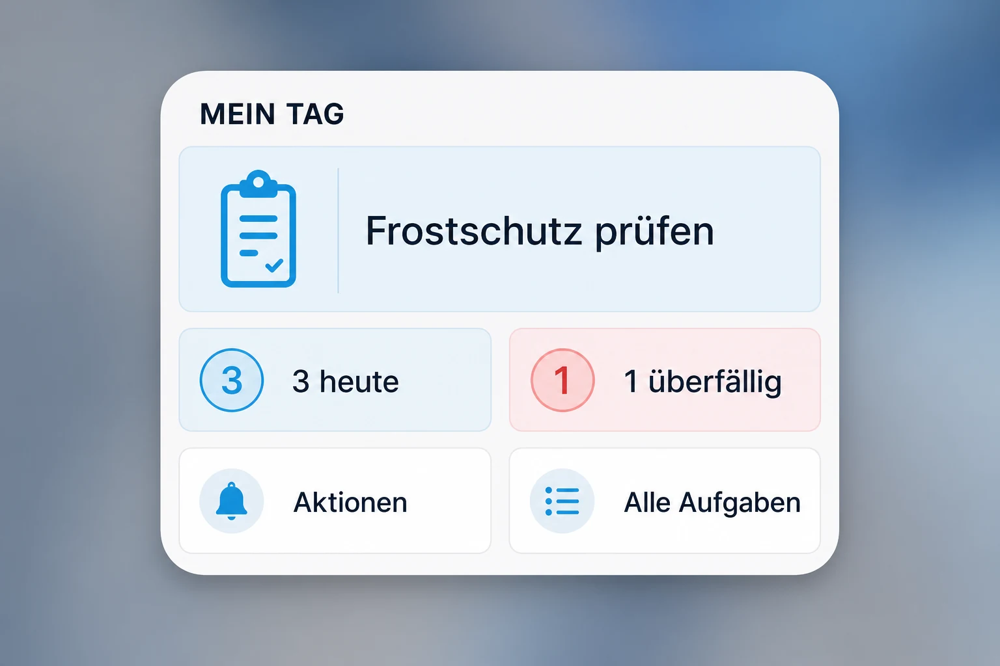
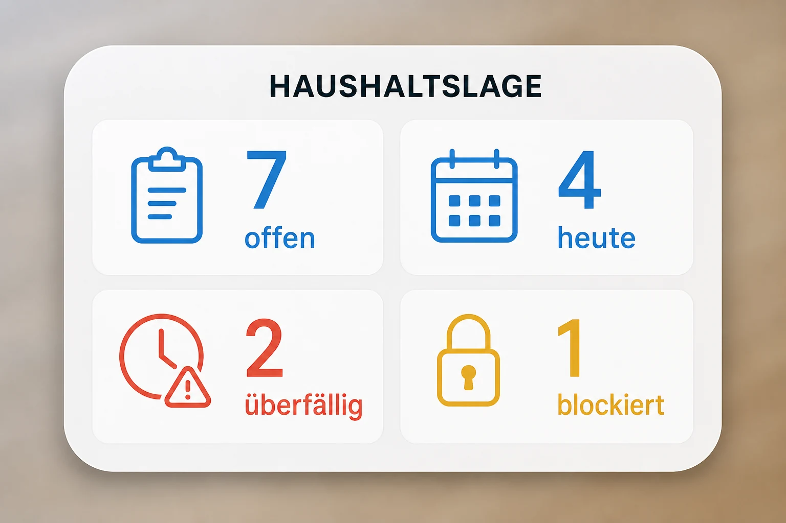
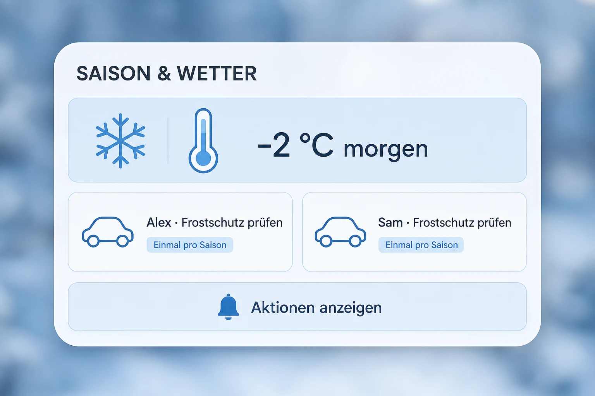
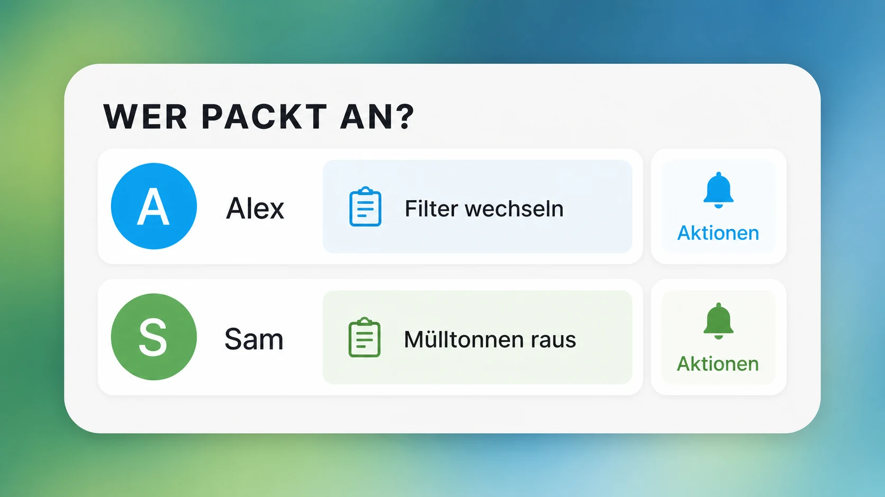

# Official Home Assistant iOS widget

Household Tasks integrates with the widgets shipped by the official Home
Assistant Companion App. This route requires no Apple Developer account, no
separate access token, and does not open Scriptable.

## What the integration creates

For every configured household person, Home Assistant creates:

- a sensor named `<person> task inbox`, whose state is the next task title and
  whose attributes contain bounded counts plus a three-task preview;
- a button named `<person> task actions`, which sends an actionable notification
  for the exact occurrence currently selected by the server.

The notification offers only actions that are valid for that occurrence, such
as complete, claim, snooze, or request help. Action identifiers contain the
stable occurrence ID, so a delayed tap cannot affect a different task that has
since moved to the top of the list.

The sensor projection is person-scoped and excludes notification service names,
presence entities, access tokens, and integration configuration. A non-admin
Home Assistant context may request actions only for its linked household person.
Like all Home Assistant entity states, inbox sensor values are visible to users
who have access to those entities. Administrators of shared installations should
restrict the generated person sensors to the intended users or omit sensitive
details from task titles.

## Prerequisites

1. Install and connect the official Home Assistant Companion App on the iPhone.
2. In Household Tasks, edit the person and select the matching Home Assistant
   user plus the iPhone's `notify.mobile_app_*` action.
3. Reload Household Tasks or restart Home Assistant after updating from a
   release that did not yet include the widget entities.

## Inspiration: four useful widget layouts

The following images are realistic configuration concepts, not screenshots of
a separate Household Tasks app. Colors, spacing, and typography vary slightly
between Home Assistant Companion App and iOS releases, but every concept uses
entity tiles and actions supported by the official Custom Widget.

### 1. My day: the practical default



Best for one person's everyday Home Screen. Use the person's `task inbox`
sensor as the wide next-task tile, the existing `Tasks due today` and `Overdue
tasks` aggregate sensors as count tiles, and the person's `task actions` button
as the notification tile. Configure the last tile to navigate to
`/haushaltsaufgaben`.

Good use cases:

- see the next sensible task before leaving home;
- notice overdue work without opening a dashboard;
- request safe, occurrence-bound actions with one tap;
- jump into the full task list only when planning is necessary.

### 2. Household status: calm operational overview



This is the simplest shared widget and uses only the four aggregate entities
created by Household Tasks: `Open tasks`, `Tasks due today`, `Overdue tasks`,
and `Blocked tasks`. It contains no task titles, making it a good fit for shared
iPads, wall displays, and less private Home Screens.

Good use cases:

- morning overview for the whole household;
- spot dependency problems before they become overdue;
- a low-distraction status widget for a shared device;
- a quick signal that the weekly review is needed.

### 3. Season and weather: context before chores



Combine an existing Home Assistant weather or forecast sensor with the
Household Tasks inbox sensors. This layout is especially useful for seasonal
rules that create one occurrence per person, such as checking frost protection
for each person's car. The small seasonal badge can be static display text; the
one-per-season guarantee remains server-side in Household Tasks.

Other combinations:

- heat forecast plus watering and pet-cooling tasks;
- storm warning plus windows, awnings, and garden furniture;
- high pollen count plus ventilation and filter checks;
- heavy rain plus basement drain and window-well inspection;
- first snow plus clearing paths and preparing grit.

For one shared action tile, create a Home Assistant script that presses the
desired person's `task actions` button. Otherwise add one action tile per
person, as in the family layout below.

### 4. Family actions: personal lanes without an app



Add each person's `task inbox` sensor next to their matching `task actions`
button. Everyone sees the division of work, while pressing an action tile sends
the notification only to that person's configured Companion App device.

Good use cases:

- couples with separate responsibilities;
- parent and teenager task lanes;
- temporary household handovers during vacation or illness;
- shared chores where each person needs an independent occurrence;
- guest mode with a deliberately reduced set of visible tasks.

### More combinations worth trying

- **Maintenance cockpit:** next task, blocked count, printer/resource warning,
  and a direct link to configuration health.
- **Evening reset:** open count, tomorrow count, quick actions, and a navigation
  tile to the weekly planner.
- **Away mode:** household mode helper, handover status, security-related tasks,
  and the intended recipient's action button.
- **Care routine:** medication or pet-care task, presence state, next due time,
  and a deliberately confirmation-protected action tile.
- **Minimal Lock Screen:** one inbox sensor showing only the next task; keep
  sensitive descriptions out of titles.

## Create the widget

1. In the Home Assistant iOS App, open **Settings > Companion App > Widgets**.
2. Select **Create** under **Custom Widgets (BETA)**.
3. Add the person's `task inbox` sensor as the first item. Configure its tap
   action as **Navigate** to `/haushaltsaufgaben`, or **Nothing** for a purely
   glanceable tile.
4. Add the person's `task actions` button as the second item and keep its tap
   action on **Default**. Optional confirmation protects against accidental
   taps.
5. Save the custom widget, add a Home Assistant widget to the iOS Home Screen,
   then select the saved configuration in the widget settings.

Tapping the action tile asks Home Assistant to send a fresh notification for
the current next task. Pressing **Complete**, **This evening**, **Tomorrow**,
**Claim**, or **Request help** in that notification runs in the background and
does not open the Home Assistant or Scriptable app.

Home Assistant documents the current widget editor and supported sizes at
<https://companion.home-assistant.io/docs/integrations/ios-widgets/>. Interactive
notification behavior is documented at
<https://companion.home-assistant.io/docs/notifications/actionable-notifications/>.

## Refresh behavior

iOS controls widget refresh scheduling and may show a cached sensor value for
roughly 15 minutes. The action button always selects the current task on the
server, regardless of the displayed cache. For important changes, an optional
automation can ask the Companion App to refresh its widgets:

```yaml
alias: Refresh Household Tasks iOS widget
mode: restart
triggers:
  - trigger: event
    event_type: household_tasks_updated
actions:
  - delay: "00:00:05"
  - action: notify.mobile_app_iphone
    data:
      message: update_widgets
```

Replace `notify.mobile_app_iphone` with the person's actual Companion App
notification action. iOS may still defer refreshes, and frequent update requests
can increase battery use.

## Troubleshooting

- **No person entities:** verify the person exists, then reload the integration.
- **Action button unavailable:** the configured `notify.mobile_app_*` action is
  missing. Open the Companion App once and restart Home Assistant if necessary.
- **Permission error:** link the logged-in Home Assistant user to the intended
  Household Tasks person. Administrators may target every configured person.
- **Notification opens an app:** use the background task buttons, not the
  notification body or its **Open task** action.
